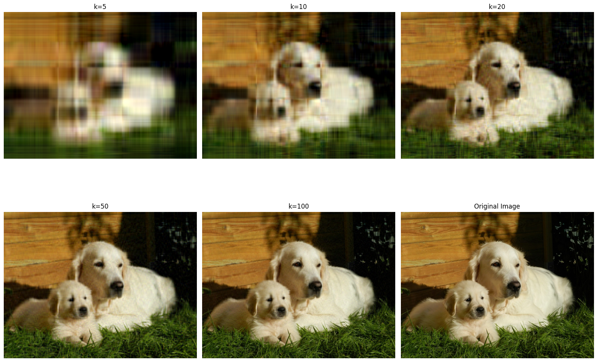
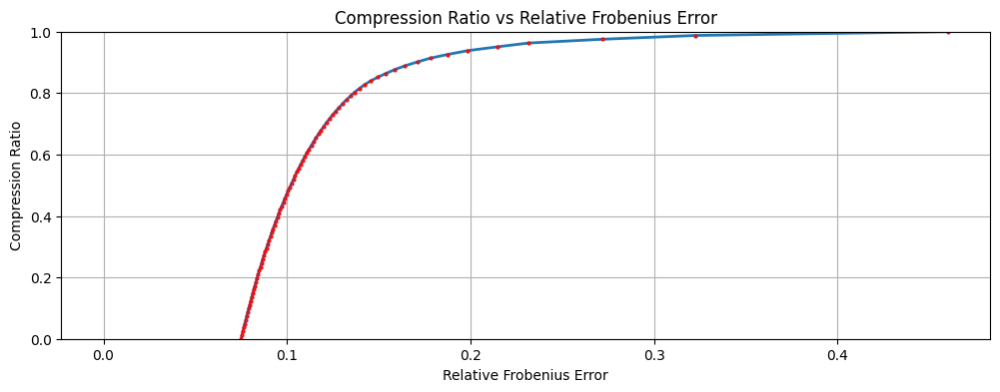
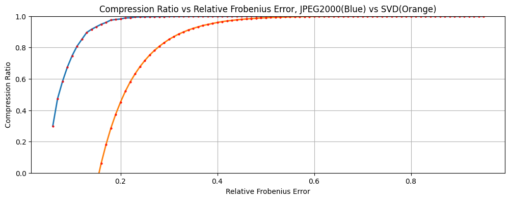
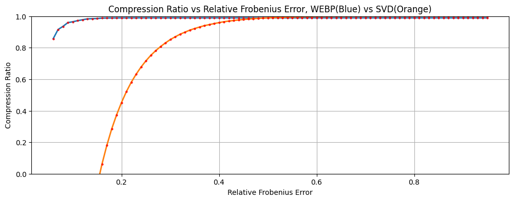

# Image Compression With Low Rank Appoximation

Reference implementation for image compression via Singular Value Decomposition (SVD).
Accompanies the paper [Image Compression Using Singular Value Decomposition](https://arxiv.org/html/2512.16226v1).

The project demonstrates low-rank image reconstruction, error-controlled compression, and benchmarking against standard codecs.

- Decomposes images channel-wise using SVD

- Reconstructs images using the smallest rank that meets a target relative Frobenius error

- Stores truncated SVD factors in a compressed binary format

- Provides a simple CLI for compressing and reconstructing images

## Command Line Usage
**General syntax**
```
python main.py [options] [input file name] [output file name]
```
- The first filename is always treated as the input file

- The second filename, if provided, is treated as the output file

- If no output filename is given, it is automatically generated from the input name

**Options:**
- `-c`, `--compress`
Compress an image file.

- `-a `, `--accuracy <0–99>`
Controls output quality. Higher values preserve more detail and increase file size.
Default: 85. <br> The algorithm selects the minimum rank $k$ such that the average [relative Frobenius error](##Defining-Accuracy) across channels is at most $1 − \frac{\text{accuracy}}{100}$

<br>

**Example: Compress an image**<br>
Compresses input.png into a `.svd` file using a target accuracy of 85.
```
python3 main.py -c input.png -a 85
```
**Example Reconstruct an image**<br>
Reconstructs an image from a `.svd` file using the specified accuracy.
```
python main.py input.svd -a 85
````


## Defining Accuracy
Let $A$ be the original image and $A_k$ the rank-k approximation.
Relative Frobenius error is defined as
<p align="center">
$$\frac{\|A - A_k\|_F}{\|A\|_F}$$
</p>
For SVD-based reconstructions, this is computed directly from the discarded singular values, averaged across channels.

The implementation finds the minimum rank that satisfies a given accuracy constraint.

## Compression Performance and Codec Comparison
Compression performance is evaluated by plotting compression ratio versus relative Frobenius error. Higher compression ratios indicate greater storage savings, while lower relative Frobenius error indicates higher reconstruction fidelity.
- At low tolerated error, compression ratios are poor and may be negative

- As tolerated error increases, compression improves rapidly

- At very high error, compression ratios saturate for all methods



Singular Value Decomposition–based compression is compared against standard image codecs at matched relative Frobenius error levels, JPEG, JPEG2000, and WEBP. In all comparisons, SVD consistently achieves lower compression ratios than industry codecs across the full range of tested error tolerances.

At low error tolerances, SVD performs especially poorly, storing truncated singular vectors and values often requires more space than the original image. But JPEG, JPEG2000, and WEBP maintain reasonable compression due to quantization, entropy coding, and perceptual optimizations. As tolerated error increases, the compression ratios of all methods improve and begin to converge. 

SVD compression is not competitive with modern image codecs in terms of storage efficiency.




